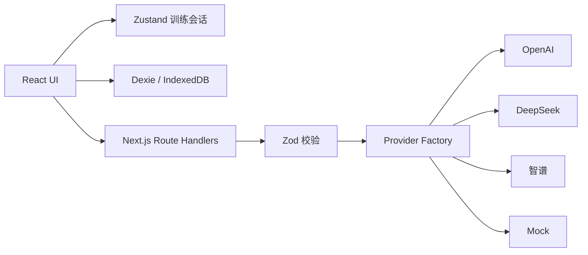

# 逻辑表达训练产品 Next.js MVP 设计规格

**日期**：2026-06-07  
**状态**：已确认，待实施计划  
**适用范围**：单人本机自用版 MVP

## 1. 目标

将现有静态 UI 原型开发为可实际运行的 Next.js 应用，完整支持：

> 设置训练 → 生成命题 → 写初稿 → AI 诊断 → 二次改写 → 对比复盘 → 本地保存 → 更新趋势与下一练

产品首次打开不注入演示数据。用户未配置 API Key 时使用内置 Mock Provider，仍可完成全部训练流程。

## 2. 设计依据

- `逻辑表达训练产品 · 单人自用版 MVP PRD.md`
- `逻辑表达训练产品 · 页面清单与线框流程图.md`
- `逻辑表达训练产品_开发技术方案.md`
- `逻辑表达训练产品_设计体系.html`
- `逻辑表达训练产品_UI效果图.html`

发生细节冲突时，优先级依次为：本规格、MVP PRD、开发技术方案、页面清单、设计体系与效果图。

## 3. 范围

### 3.1 MVP 包含

- Next.js App Router、React、TypeScript。
- Tailwind CSS 与 CSS Variables。
- Zustand 当前训练状态。
- Dexie/IndexedDB 本地训练数据。
- Zod 请求、配置和 AI 响应校验。
- Recharts 趋势与能力图表。
- OpenAI、DeepSeek、智谱和 Mock Provider。
- 可配置 Base URL、API Key 和模型。
- 仪表盘、五步训练工作台、历史抽屉和设置弹窗。
- 草稿自动保存、刷新恢复和训练历史复看。
- 桌面与移动端响应式布局。

### 3.2 MVP 不包含

- 登录、注册、账号与多人数据隔离。
- 云端数据库、云同步和跨设备恢复。
- 付费、社区、排行榜和多人训练。
- 语音输入、语音评分和移动原生应用。
- AI 完整代写或系统课程。
- 公网部署所需的生产级密钥托管。

## 4. 架构

采用领域模块化单体：一个 Next.js 工程承载 UI 与本机 API，内部按职责拆分。



### 4.1 模块职责

| 模块 | 负责 | 不负责 |
| --- | --- | --- |
| UI | 页面、输入、加载、错误和可访问交互 | 供应商响应差异 |
| Zustand | 当前会话和即时界面状态 | 长期历史存储 |
| Dexie | 未完成会话、草稿和训练历史 | API Key |
| Route Handler | 请求校验、Provider 调用和统一错误 | 保存训练历史 |
| Provider Adapter | 鉴权、请求格式、响应转换 | 页面状态 |
| Analytics | 趋势、短板和下一练计算 | 调用 AI |

### 4.2 关键边界

- 业务代码只依赖统一 Provider 接口。
- 所有 AI 结果通过 Zod 校验后才能进入 UI。
- 一次训练固定使用同一 Provider 和模型。
- AI 请求前先保存用户当前文本。
- AI 失败时停留在当前步骤，不清空或覆盖草稿。

## 5. 页面与交互

### 5.1 路由

| 路由 | 页面 |
| --- | --- |
| `/` | 训练仪表盘 |
| `/training` | 五步训练工作台 |

历史记录使用右侧抽屉，本地设置使用居中弹窗。

### 5.2 仪表盘

- 首次打开显示空状态与开始第一次训练入口。
- 完成训练后显示逻辑分、表达分、改写提升、最近七次趋势、能力分布、最近记录和下一练。
- 搜索可匹配命题标题、场景、训练目标和短板。

### 5.3 训练状态机

```text
setup → topic → draft → diagnosis → result
```

允许回退：

- `topic → setup`
- `draft → topic`
- 请求失败后停留当前步骤

禁止绕过初稿或二次改写直接进入结果。刷新后恢复到最近成功保存的步骤。

### 5.4 五步工作台

1. 设置：选择职场观点或生活价值观点，以及简单、中等或有挑战。
2. 命题：展示标题、背景、主问题、任务、约束和评分侧重点，可重新生成。
3. 初稿：输入 200-400 字，实时计数并自动保存。
4. 诊断改写：展示总评、最大逻辑问题、最大表达问题、追问和改写任务。
5. 结果：展示两版分数、置信度、文本对比、改进点、剩余问题和下一练。

### 5.5 历史与设置

- 历史抽屉支持场景筛选、搜索和打开完整复盘。
- 设置弹窗支持 Provider、Base URL、API Key、模型和连接测试。
- 清空训练数据与清空 Provider 设置是两个独立操作。
- 危险操作必须二次确认。

## 6. AI 设计

### 6.1 请求类型

- `POST /api/ai/topic`
- `POST /api/ai/diagnosis`
- `POST /api/ai/comparison`
- `POST /api/providers/test`

### 6.2 Provider

| Provider | 默认 Base URL | 可配置 |
| --- | --- | --- |
| OpenAI | 官方 OpenAI API 地址 | Base URL、API Key、模型 |
| DeepSeek | 官方 DeepSeek API 地址 | Base URL、API Key、模型 |
| 智谱 | 官方智谱 API 地址 | Base URL、API Key、模型 |
| Mock | 本地确定性实现 | 无需配置 |

具体默认模型在实施时作为可修改常量集中维护，不散落在组件中。

### 6.3 Mock 行为

- 没有可用 API Key 时自动选择 Mock。
- Mock 根据场景、难度、训练目标和文本特征返回完整结构化结果。
- 相同关键输入产生稳定结果，确保测试可重复。
- Mock 输出明确标记为模拟结果。

真实 Provider 请求失败时不自动切换 Mock，防止用户误认结果来源。

### 6.4 响应校验

- AI 必须返回严格 JSON。
- 首次解析或 Schema 校验失败时，执行一次修复请求。
- 第二次失败后返回统一可重试错误。
- 修复请求只用于格式修复，不改变用户任务内容。

## 7. 数据设计

### 7.1 Provider 设置

Provider 设置保存在 `localStorage`：

- 当前 Provider。
- Base URL。
- API Key。
- 模型。
- 最近连接测试结果与时间。

这些信息不写入训练历史，不输出到服务端日志。

### 7.2 IndexedDB

至少包含：

- `trainingSessions`：未完成会话和草稿。
- `trainingRecords`：已完成训练。

训练记录保存：

- Provider、模型和 Prompt 版本。
- 场景、难度和训练目标。
- 命题快照。
- 初稿、改写稿。
- 诊断与对比结果。
- 分数、提升幅度、最低维度和完成时间。

### 7.3 保存策略

- 选择配置、命题生成成功和步骤流转后立即保存。
- 初稿和改写稿停止输入约 500 毫秒后保存。
- AI 请求前强制保存。
- 进入结果页后写入完整记录，并清理对应未完成会话。

## 8. 推荐与统计

趋势、短板和下一练使用确定性 TypeScript 函数计算：

- 无历史：推荐“论证充分性”。
- 1-2 次记录：采用最近一次最低分维度。
- 3 次及以上：采用最近三次平均分最低维度。
- 同分时优先逻辑维度，再选择表达维度。
- 命题生成携带最近五次主题标签以避免重复。

## 9. 错误处理

- 网络或 Provider 错误：保留文本，显示原因和重试按钮。
- AI 格式错误：自动修复一次，失败后允许重试。
- IndexedDB 不可用：显示阻断提示，不假装已保存。
- 配置缺失：使用 Mock，不阻止训练。
- 连接测试失败：不覆盖之前可用配置。
- 页面刷新：恢复最近未完成会话。

## 10. 视觉与响应式

- 复用现有三栏 SaaS Dashboard 视觉体系。
- 桌面端：深色侧栏、象牙白工作区、浅色洞察栏。
- 中等宽度：隐藏独立洞察栏，将摘要内容并入主区。
- 移动端：顶部导航、单栏内容、可横向滚动阶段条、全宽抽屉。
- 使用鼠尾草绿、柔黄、薰衣草紫分别表达逻辑、提醒和改写提升。
- 保持现有效果图的圆角、低阴影和数据层级，不重新设计品牌风格。

## 11. 测试

### 11.1 单元测试

- Zod Schema。
- 训练状态机。
- 推荐和统计逻辑。
- Mock Provider。
- 三家真实 Provider 的请求转换和响应归一化。

### 11.2 组件测试

- 场景和难度选择。
- 字数限制和提交状态。
- 步骤流转。
- 加载、错误和重试。
- 设置保存和危险操作确认。

### 11.3 端到端测试

- 首次空状态。
- Mock 完整训练闭环。
- 草稿刷新恢复。
- 历史筛选与复盘。
- 清空训练数据。
- Provider 配置和连接测试。

真实 AI 调用不进入自动化测试。

## 12. 验收标准

- 无 API Key 时可使用 Mock 完成全部训练流程。
- 配置 OpenAI、DeepSeek 或智谱后，可使用对应真实 Provider。
- Base URL、API Key 和模型均可配置。
- 首次进入不显示虚构训练数据。
- 草稿、未完成会话和历史记录在刷新后保留。
- 用户不能跳过初稿或改写。
- 历史记录可以打开完整复盘。
- 桌面和移动布局无关键内容溢出或遮挡。
- 自动化测试覆盖核心状态、数据规则和完整 Mock 流程。

